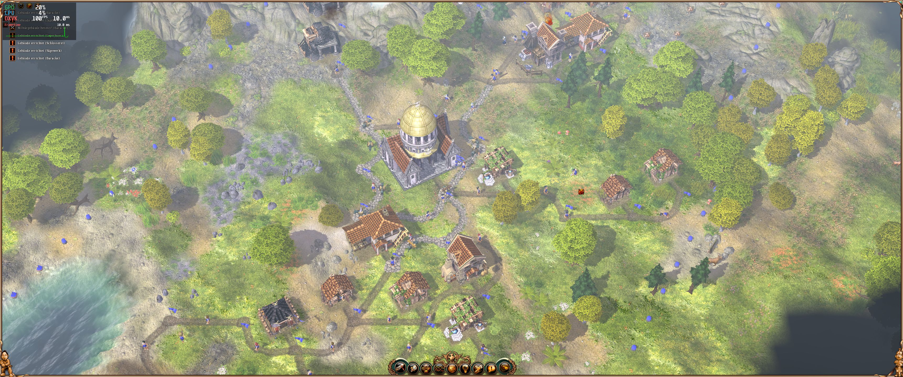
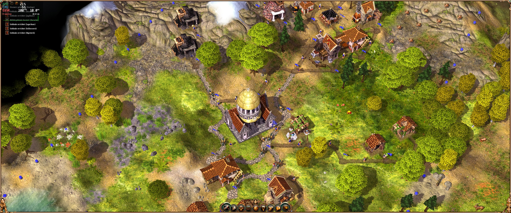

# The Settlers: 10th anniversary widescreen fix
Widescreen fix for The Settlers: 10th anniversary edition

## Supported Versions
- GOG version (11757)
    - `S2DNG.exe` SHA256 `484a8afc396df4ae0e9429b604993dcb5e238f2c0f0fe6d5085ab4620af548b7`
- Retail CD version with 11757 patch and noCD
    - `S2DNG.exe` SHA256 `178a4299a2dc441aa8ed2f32e050f9a99ef40150f42e2c1acd8b00933db1285e`
- Retail CD Wikinger Addon (11758) and noCD
    - `s2dng_addon.exe` SHA256 `f461cbaa27e523a0ae8eb6fd6e318c5c21df5e2eddda9f6a4d424aa08b8c17e8`

- Retail CD for Rise of Cultures / Aufbruch der Kulturen (34688) and noCD
    - `SADK.exe` SHA256 `e630d0b0c48c28f767cce64f96b25abb15156b7e8d53429678210b1456e60ee2`

**NOTE:** Patched CD version without noCD patch *should* also work, but it is not tested.

## Showcase
### Original

### Patched

### Patched + FogPatch

