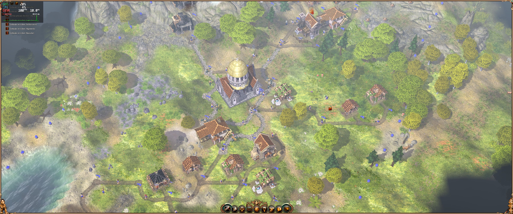
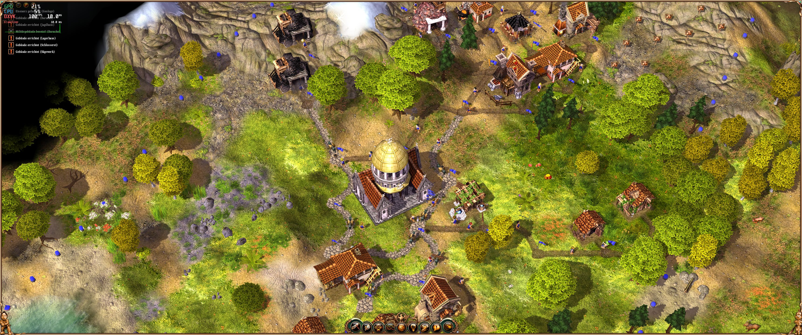

# The Settlers: 10th anniversary widescreen fix
Widescreen fix for The Settlers: 10th anniversary edition

Widescreen fix for "Aufbruch der Kulturen" can be found [here](https://github.com/zocker-160/Die-Siedler-Aufbruch-der-Kulturen-widescreen-fix).

## Installation

An installer was created by KonradAr on ModDB, you can download it from there:

https://www.moddb.com/games/the-settlers-ii-10th-anniversary/downloads/widescreen-fix/

you can also just compile it from source ;)

## Supported Versions
- GOG version (11757)
    - `S2DNG.exe` SHA256 `484a8afc396df4ae0e9429b604993dcb5e238f2c0f0fe6d5085ab4620af548b7`

- Retail Gold Edition CD (11757 and 11758) + official noCD patches
	- `s2dng.exe` SHA256 `3bc844be08d3c15ccf40c0b3dc1ff19a858c01ac48738a441033b352cb1217f1`
	- `s2dng_addon.exe` SHA256 `091944faf932c30825fb4920d71247c427e75a497ce01fe2540ad8595f655ef9`

**NOTE: CD versions with the original exe are not tested and will not work!**

## Showcase
### Original

### Patched

### Patched + FogPatch

